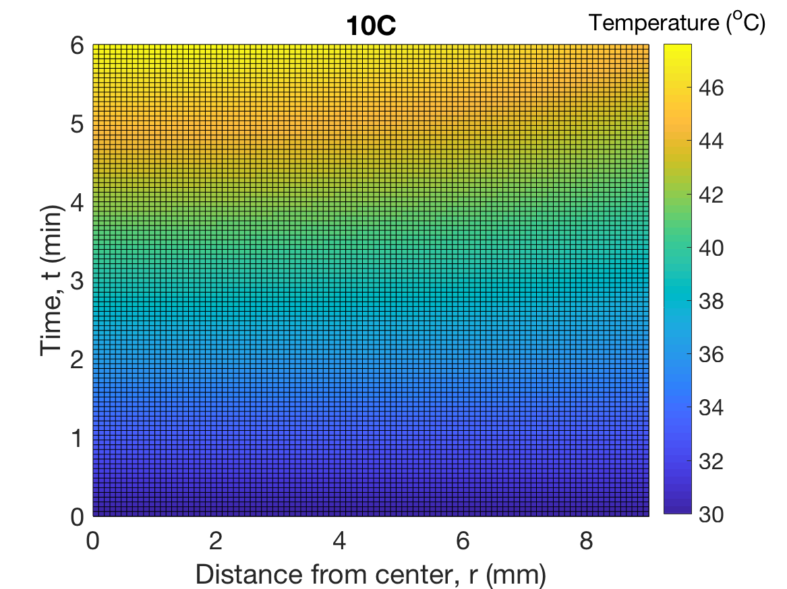

# 18650-thermal-modeling

Simple MATLAB model of temperature profiles within a (dis)charging battery.
Check out [this post](https://petermattia.com/articles/2017/11/09/thermal-modeling-cylindrical-batteries.html) for more info.

